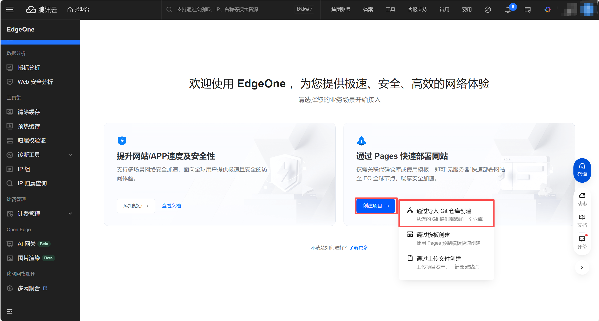
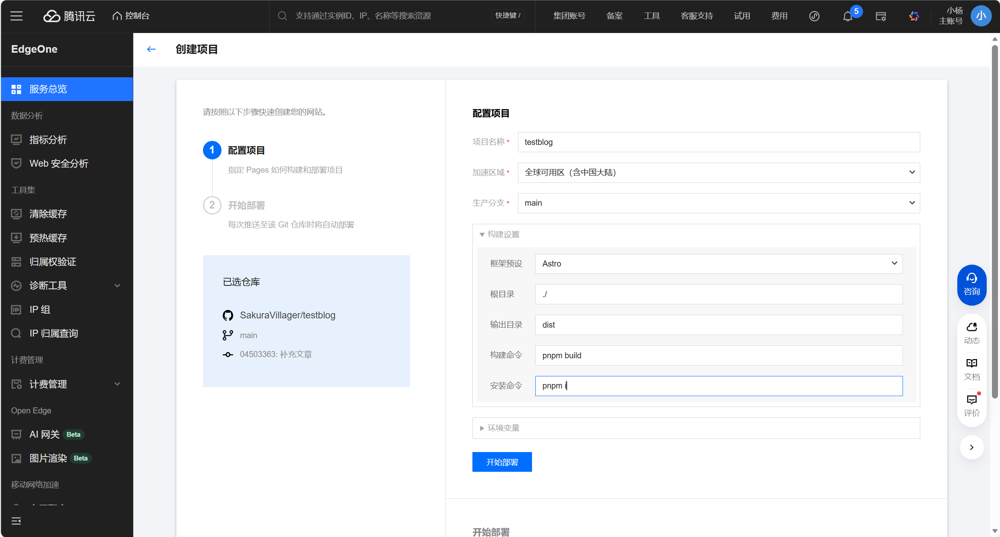
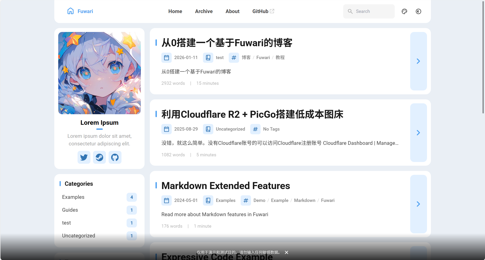
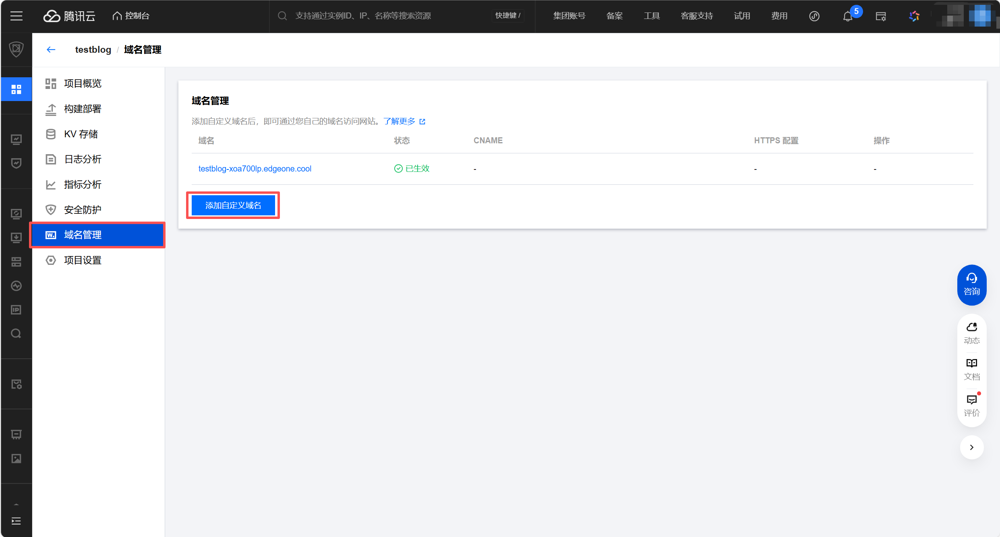
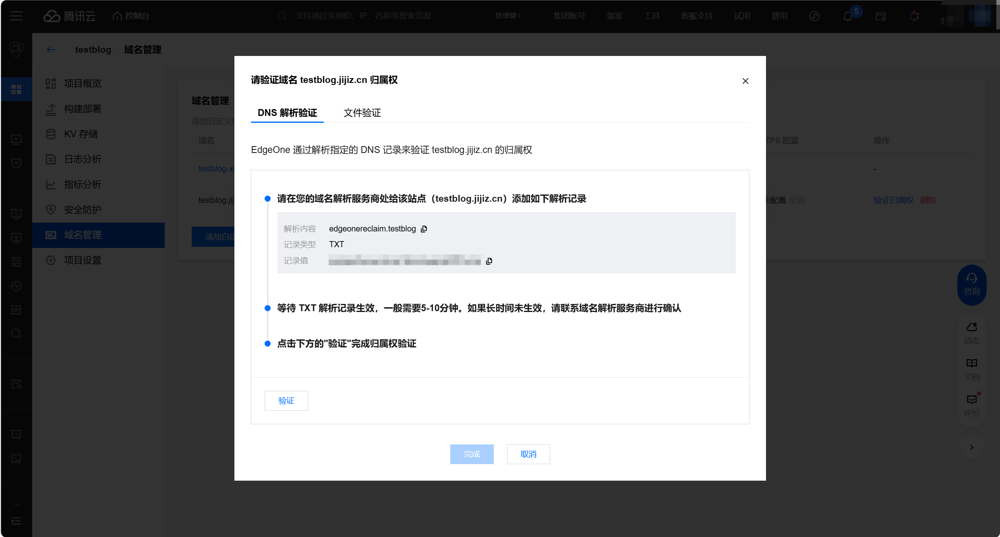
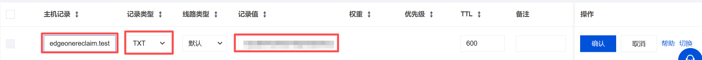
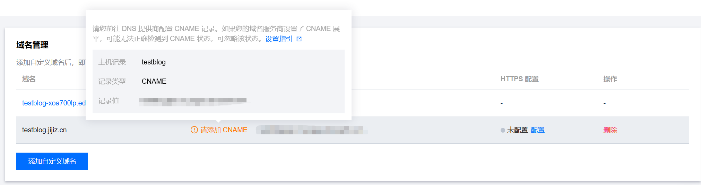
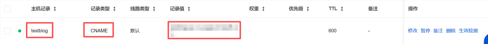
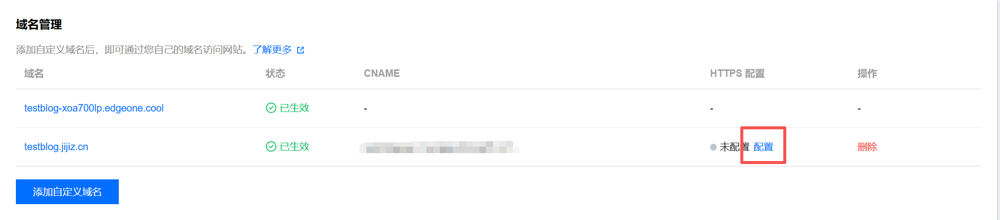
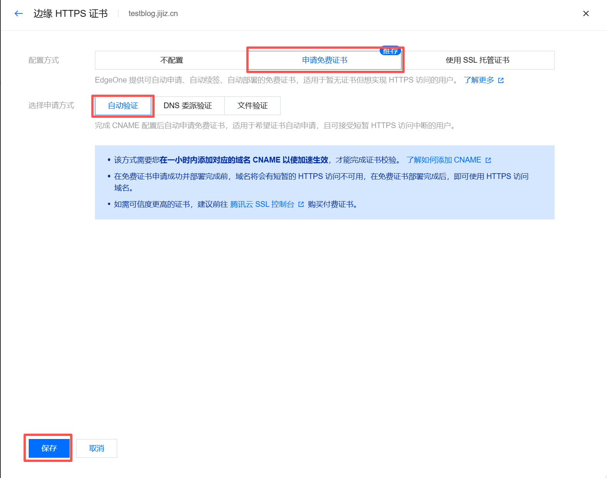

> 本博客的前身是基于typecho的。但由于服务器即将到期，于是决定换一个静态博客。在网上看到了很多模板，如`Hexo`、`Hugo`等，但还是最喜欢这个的设计风格。于是着手搭建，顺便写一篇文章记录一下。

::github{repo="saicaca/fuwari"}
# 前置条件
> [!tip]
>如果你已经完成一下环境的部署，那么可以跳过这一部分。
>1. 安装 Git
>2. 安装 Node.js 且 Node.js >= 20
>3. pnpm >= 9
>4. 一个 Github 账号，用于存放Fuwari文件。也可以是其他git托管平台。
## 安装 Git
访问 [Git](https://git-scm.com/downloads) ，下载并安装。
安装完成后可以打开命令行并运行以下命令来验证 Git 是否安装成功：
```bash
git --version
```
如果显示版本号，则表示安装成功。
## 安装 Node.js
访问 [Node.js 官网](https://nodejs.org/) 下载并安装最新版本的 Node.js。建议使用 LTS 版本。
安装完成后打开命令行，运行以下命令验证 Node.js 是否安装成功：
```bash
node -v
npm -v
```
如果显示版本号，则表示安装成功。
## 安装 pnpm
通过 npm 安装pnpm。
打开命令行，运行如下命令：
```bash
npm install -g pnpm
```
安装完成后在命令行继续运行以下命令验证 pnpm 是否安装成功：
```bash
pnpm -v
```
如果显示版本号，则表示安装成功。
## 创建GitHub账户
访问[Github](https://github.com/)并创建账号。
> [!tip]
>这边使用的是GitHub作为演示，但你还可以通过其他git仓库储存你的博客文件，例如gitee、gitlab等。
# 本地启动项目
## 克隆 Fuwari 到本地
新建一个文件夹用于存放博客代码。然后在该目录下打开命令行：
```bash
git clone https://github.com/saicaca/fuwari.git
```
克隆完成将如下图所示：

## 安装项目依赖
在命令行执行以下命令进入根目录并安装依赖：
```bash
cd fuwari
pnpm install
```
> [!tip]
>如果安装过程中遇到`warn`，可能只是版本兼容性等问题，对我们的博客几乎没有影响，可以忽略不记。只要没有看到`error`就说明你已经成功的安装依赖了。
## 本地运行 Fuwari 
> [!tip]
>这个功能一般用于撰写完文章后的预览和检查，并非实际部署。

在根目录下的命令行中运行以下代码：
```bash
pnpm dev
```
等待终端输出
```text
  astro  v5.x.x ...

  Local    http://localhost:4321
  Network  http://192.168.xx.xx:4321
```
此时按住`ctrl`并用鼠标点击Local行的网址，就可以转跳到默认浏览器访问该网址，也就是我们的博客。
如果你看到如图所示的默认首页，那么恭喜你本地部署部分就完成了。
# 撰写博客文章

> [!tip]
>这里先介绍一下官方给出的写作方法。本文在后文使用`VSCode`和`Obsidian`进行写作演示，你也可以用其他markdown编辑器来编写文章。例如typora等。

在根目录下打开命令行，执行：
```bash
pnpm new-post <filename>
```
> [!note]
>此处需要把`<filename>`替换为你的文章标题。

这行代码的作用就是在`src/content/posts/`目录中新建一个`<filename>.md`文件，文件中自动包含了以下属性：
```markdown
---
title: My First Blog Post
published: 2023-09-09
description: This is the first post of my new Astro blog.
image: /images/cover.jpg
tags: [Foo, Bar]
category: Front-end
draft: false
language: zh
---
```
这些属性具体含义如下：

| 属性          | 含义                                       |
| :---------- | :--------------------------------------- |
| title       | 你的文章标题                                   |
| published   | 文章发布时间                                   |
| description | 简单描述你的文章（可空）                             |
| image       | 文章主页的封面（可空，路径示例：/images/cover.jpg）       |
| tags        | 文章标签（数组格式，示例：[Foo, Bar]）                 |
| category    | 文章分类                                     |
| draft       | 文章是否为草稿（默认false；设置为true后部署不可见，本地开发预览时可见） |
| language    | 文章语言（可空）                                 |

随后你就可以打开这个`markdown`文件愉快的编写博客文章了。
> [!warning]
>你编写的文章开头一定包含这些属性，否则会导致博客预览或构建时失败并报错！
# 提交到Git并推送
> [!tip]
>这里先介绍一下普通上传git的方法。本文将在后文使用`GitHub`作为仓库，展示使用`VSCode`和`Obsidian`进行0代码上传git。你也可以用其他git仓库，如`gitee`、`GitLab`等平台来托管你的博客代码。

## 提交到git
如果你时采用克隆的方式下载Fuwari，而不是直接下载压缩包的话，应该会自带初始化过的git。虽然直接用也可以，但我推荐自己重新初始化以下。
在项目根目录命令行执行以下命令以删除原有git，或直接手动删除`.git`文件夹。
```bash
rm -r -Force .git
```
接着输入以下命令初始化新的git仓库并进行第一次提交：
```bash
git init
git add .
git commit -m "初始化"
```
> [!tip] 对没用过git的人解释一下提交
>当点击提交按钮时，这个模板就会被保存到本地git中，类似于存档。当你后续的编辑除了问题，比如不小心把文件全删了，就可以通过这个存档回到你最后提交的状态状态。
## 推送到在线代码托管平台
为了推送到GitHub上，你首先需要在GitHub上新建一个仓库，用于储存你的博客。在GitHub任意界面点击`+`-`New repository`。按提示配置，私有或公开都可以。懒的话就起个名，其他保持默认直接创建即可。

随后你会看到这样一个页面：

复制上图方框处的代码，粘贴到命令行并执行。当你看到如下提示，则表示你成功了：
```text
To https://github.com/你的用户名/astro-blog-demo.git
 * [new branch]      main -> main
Branch 'main' set up to track remote branch 'main' from 'origin'.
```
你可以回到你仓库页面检查以下文件是不是传上去了。
## 后续写作流程
以上流程适用于初次配置。后续写作不需要用到这么多代码。你基本只需要：
1. 写作
2. 预览，使用`pnpm dev`
3. 提交，使用`git commit -m "你本次提交的名字"`
4. 推送，使用`git push -u origin main`
# 在线部署你的博客(托管+绑定域名)
## 使用Pages服务托管你的博客
> [!tip]
>虽然你的博客已经被提交到GitHub上了，但还是没有实现在线呈现。你固然可以租一个服务器来部署你的博客，但我认为大多数人肯定是希望白嫖的。由于阿里云国内刚开通边缘安全加速服务(ESA)，想拿来体验一下，于是本篇文章使用`EdgeOne`作为演示。你当然可以部署到其他Pages服务托管平台，例如`Cloudflare Pages`等，也可以直接部署到`Vercel`等平台。

进入[EdgeOne控制台](https://console.cloud.tencent.com/edgeone)，点击`创建项目`-`通过导入Git仓库创建`，选择你的仓库。


展开构建设置，在安装命令处填写：
```text
pnpm i
```
在构建命令处填写：
```text
pnpm build
```
在输出目录处填写：
```text
dist
```
填写完成点击`开始部署`。如果一切正常，可以看到提示：
```text
Deployment completed
```
点击`预览`-`你的网址`，你就可以在线访问你的博客了。

## 绑定域名
> [!tip]
>前提条件：确保已准备好一个域名。

点击侧边栏的`域名管理`-`添加自定义域名`。

输入自己的自定义域名后，会转跳到验证界面：

按照提示在你托管域名的平台添加一条解析记录：

添加完成后点击`验证`，验证成功后点击`完成`。这时看到自定义域名状态变为`部署中`，等待一段时间后不出意外的话就会显示部署失败，提示你添加CNAME。

继续添加一条解析记录：

回到`EdgeOne`可以看到`部署成功`字样，这时进入你自定义的域名就可以访问了。
但是当打开网址你会发现是http访问，别人访问你的网站会弹出提示不安全。接下来我们还需要配置https证书。在`EdgeOne`中点击`配置`-`边缘 HTTPS 证书`。稍等片刻，证书部署完毕，就可以正常地访问我们的博客了。


