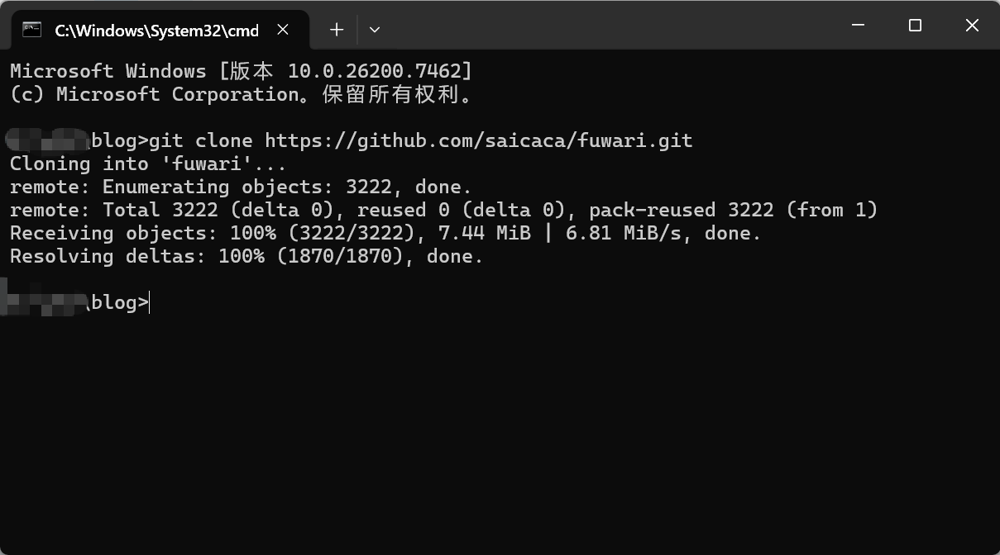
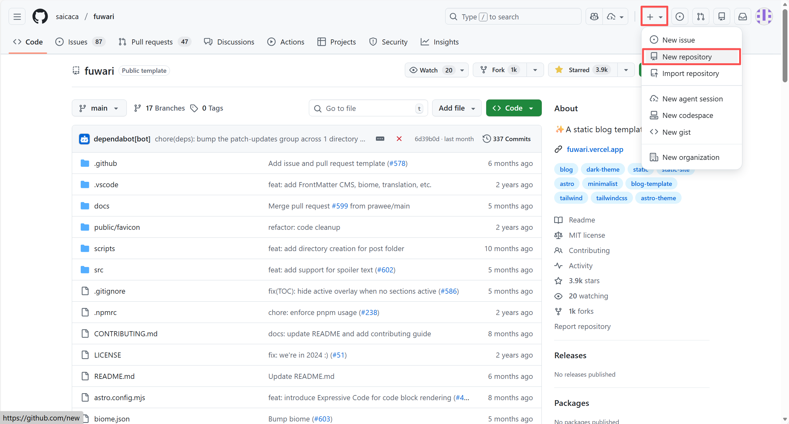
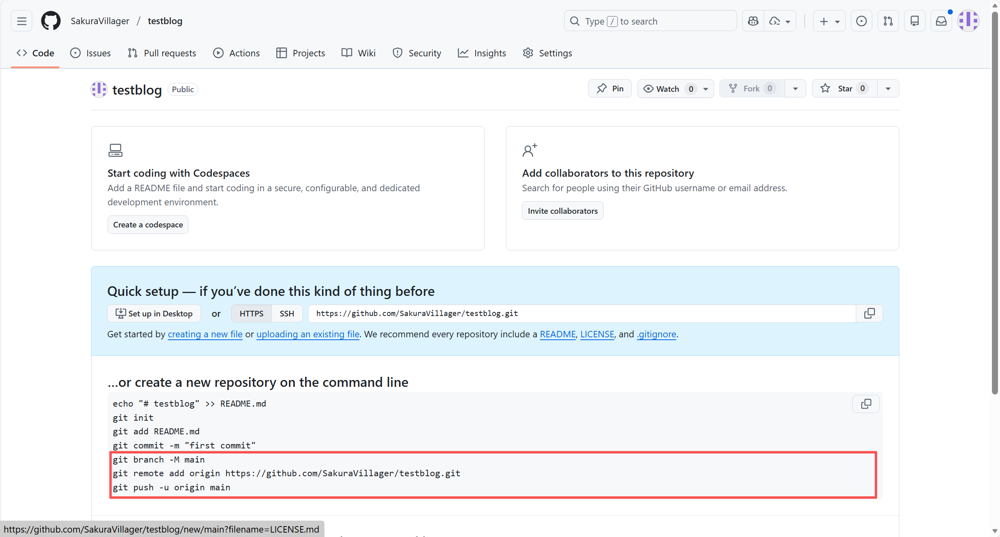
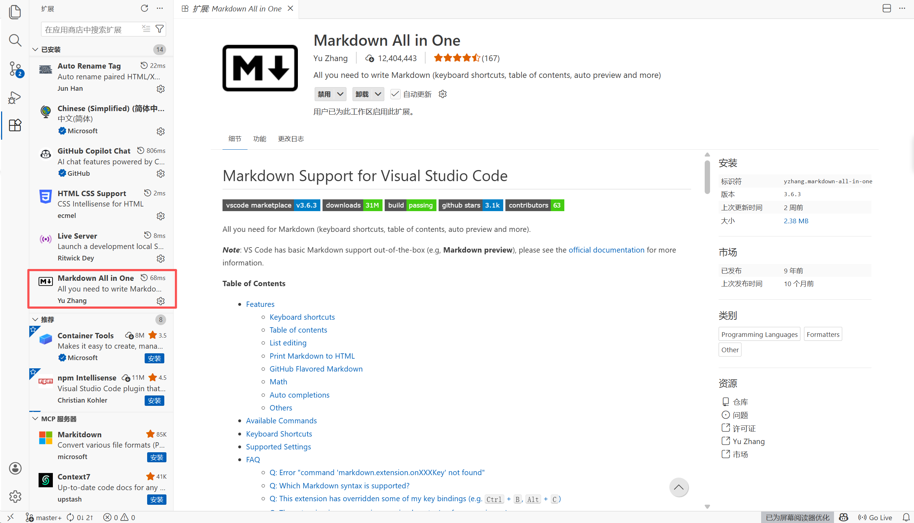
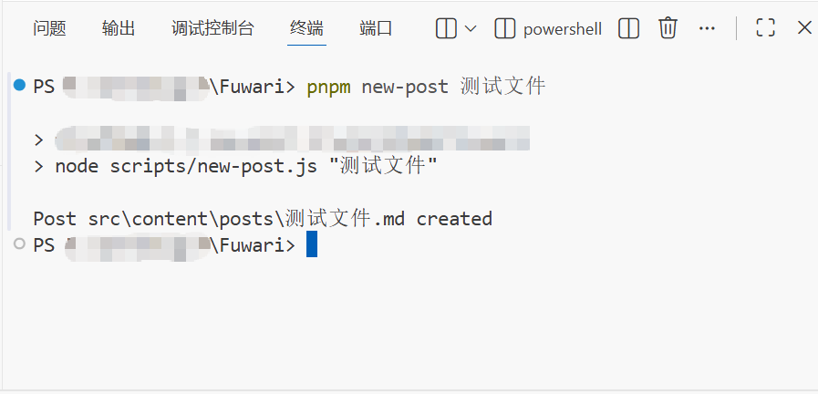
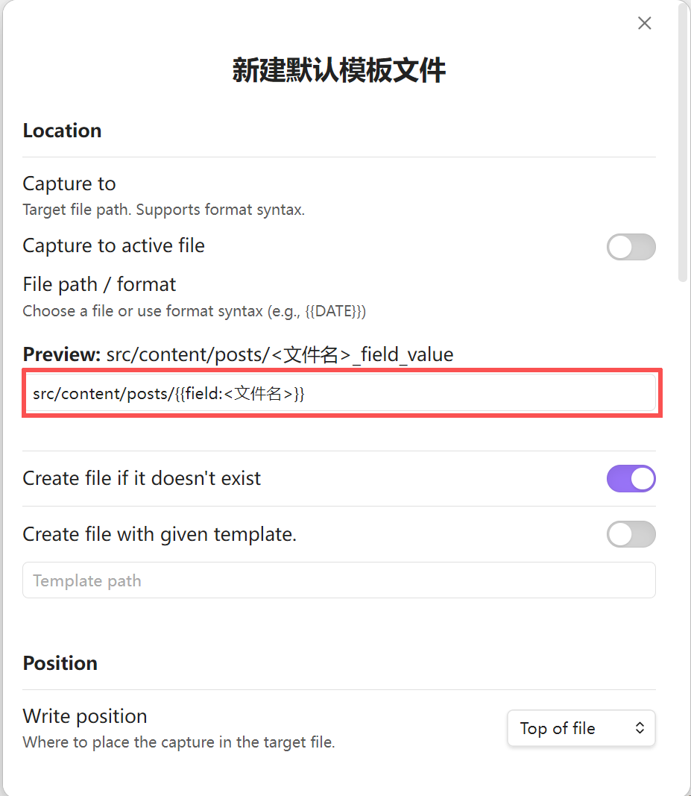
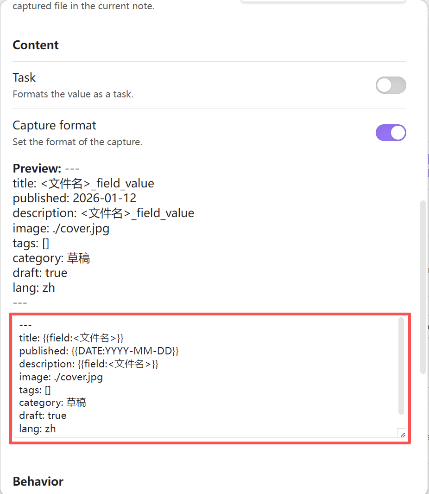
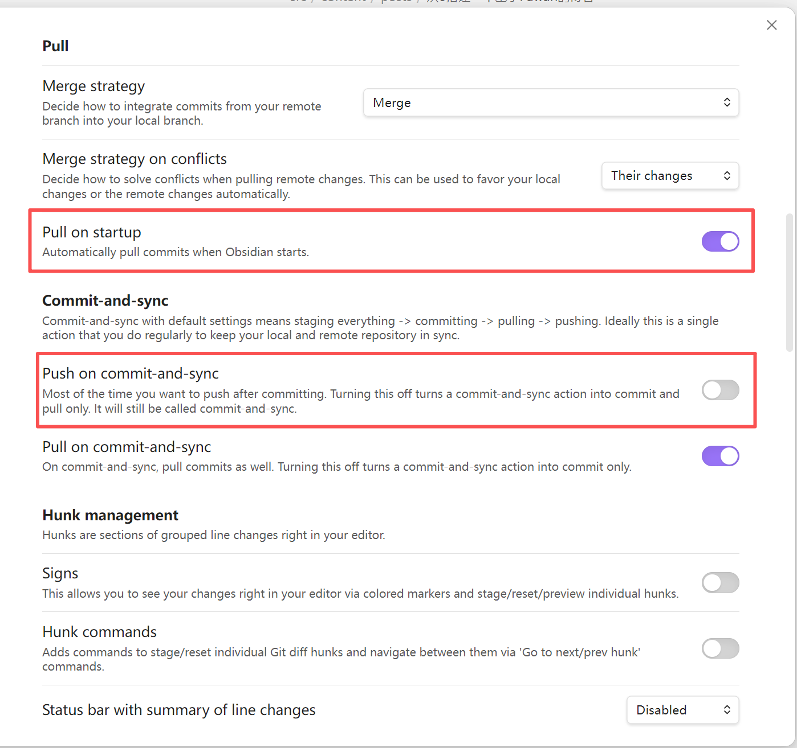

> 本博客的前身是基于typecho的。但由于服务器即将到期，于是决定换一个静态博客。在网上看到了很多模板，如`Hexo`、`Hugo`等，但还是最喜欢这个的设计风格。于是着手搭建，顺便写一篇文章记录一下。

::github{repo="saicaca/fuwari"}

# 前置条件

> [!tip]
> 如果你已经完成一下环境的部署，那么可以跳过这一部分。
>
> 1.  安装 Git
> 2.  安装 Node.js 且 Node.js >= 20
> 3.  pnpm >= 9
> 4.  一个 Github 账号，用于存放Fuwari文件。也可以是其他git托管平台。

## 安装 Git

访问 [Git](https://git-scm.com/downloads) ，下载并安装。
安装完成后可以打开命令行并运行以下命令来验证 Git 是否安装成功：

```bash
git --version
```

如果显示版本号，则表示安装成功。

## 安装 Node.js

访问 [Node.js 官网](https://nodejs.org/) 下载并安装最新版本的 Node.js。建议使用 LTS 版本。
安装完成后打开命令行，运行以下命令验证 Node.js 是否安装成功：

```bash
node -v
npm -v
```

如果显示版本号，则表示安装成功。

## 安装 pnpm

通过 npm 安装pnpm。
打开命令行，运行如下命令：

```bash
npm install -g pnpm
```

安装完成后在命令行继续运行以下命令验证 pnpm 是否安装成功：

```bash
pnpm -v
```

如果显示版本号，则表示安装成功。

## 创建GitHub账户

访问[Github](https://github.com/)并创建账号。

> [!tip]
> 这边使用的是GitHub作为演示，但你还可以通过其他git仓库储存你的博客文件，例如gitee、gitlab等。

# 本地启动项目

## 克隆 Fuwari 到本地

新建一个文件夹用于存放博客代码。然后在该目录下打开命令行：

```bash
git clone https://github.com/saicaca/fuwari.git
```

克隆完成将如下图所示：


## 安装项目依赖

在命令行执行以下命令进入根目录并安装依赖：

```bash
cd fuwari
pnpm install
```

> [!tip]
> 如果安装过程中遇到`warn`，可能只是版本兼容性等问题，对我们的博客几乎没有影响，可以忽略不记。只要没有看到`error`就说明你已经成功的安装依赖了。

## 本地运行 Fuwari

> [!tip]
> 这个功能一般用于撰写完文章后的预览和检查，并非实际部署。

在根目录下的命令行中运行以下代码：

```bash
pnpm dev
```

等待终端输出

```text
  astro  v5.x.x ...

  Local    http://localhost:4321
  Network  http://192.168.xx.xx:4321
```

此时按住`ctrl`并用鼠标点击Local行的网址，就可以转跳到默认浏览器访问该网址，也就是我们的博客。
如果你看到如图所示的默认首页，那么恭喜你本地部署部分就完成了。

# 撰写博客文章

> [!tip]
> 这里先介绍一下官方给出的写作方法。本文在后文使用`VSCode`和`Obsidian`进行写作演示，你也可以用其他markdown编辑器来编写文章。例如typora等。

在根目录下打开命令行，执行：

```bash
pnpm new-post <filename>
```

> [!note]
> 此处需要把`<filename>`替换为你的文章标题。

这行代码的作用就是在`src/content/posts/`目录中新建一个`<filename>.md`文件，文件中自动包含了以下属性：

```markdown
---
title: My First Blog Post
published: 2023-09-09
description: This is the first post of my new Astro blog.
image: /images/cover.jpg
tags: [Foo, Bar]
category: Front-end
draft: false
language: zh
---
```

这些属性具体含义如下：

| 属性        | 含义                                                                    |
| :---------- | :---------------------------------------------------------------------- |
| title       | 你的文章标题                                                            |
| published   | 文章发布时间                                                            |
| description | 简单描述你的文章（可空）                                                |
| image       | 文章主页的封面（可空，路径示例：/images/cover.jpg）                     |
| tags        | 文章标签（数组格式，示例：[Foo, Bar]）                                  |
| category    | 文章分类                                                                |
| draft       | 文章是否为草稿（默认false；设置为true后部署不可见，本地开发预览时可见） |
| language    | 文章语言（可空）                                                        |

随后你就可以打开这个`markdown`文件愉快的编写博客文章了。

> [!warning]
> 你编写的文章开头一定包含这些属性，否则会导致博客预览或构建时失败并报错！

# 提交到Git并推送

> [!tip]
> 这里先介绍一下普通上传git的方法。本文将在后文使用`GitHub`作为仓库，展示使用`VSCode`和`Obsidian`进行0代码上传git。你也可以用其他git仓库，如`gitee`、`GitLab`等平台来托管你的博客代码。

## 提交到git

如果你时采用克隆的方式下载Fuwari，而不是直接下载压缩包的话，应该会自带初始化过的git。虽然直接用也可以，但我推荐自己重新初始化以下。
在项目根目录命令行执行以下命令以删除原有git，或直接手动删除`.git`文件夹。

```bash
rm -r -Force .git
```

接着输入以下命令初始化新的git仓库并进行第一次提交：

```bash
git init
git add .
git commit -m "初始化"
```

> [!tip] 对没用过git的人解释一下提交
> 当点击提交按钮时，这个模板就会被保存到本地git中，类似于存档。当你后续的编辑除了问题，比如不小心把文件全删了，就可以通过这个存档回到你最后提交的状态状态。

## 推送到在线代码托管平台

为了推送到GitHub上，你首先需要在GitHub上新建一个仓库，用于储存你的博客。在GitHub任意界面点击`+`-`New repository`。按提示配置，私有或公开都可以。懒的话就起个名，其他保持默认直接创建即可。

随后你会看到这样一个页面：

复制上图方框处的代码，粘贴到命令行并执行。当你看到如下提示，则表示你成功了：

```text
To https://github.com/你的用户名/astro-blog-demo.git
 * [new branch]      main -> main
Branch 'main' set up to track remote branch 'main' from 'origin'.
```

你可以回到你仓库页面检查以下文件是不是传上去了。

## 后续写作流程

以上流程适用于初次配置。后续写作不需要用到这么多代码。你基本只需要：

1. 写作
2. 预览，使用`pnpm dev`
3. 提交，使用`git commit -m "你本次提交的名字"`
4. 推送，使用`git push -u origin main`

# 推荐两款软件实现低代码写作与上传

## 使用VSCode编辑文章与上传代码

> `VSCode`是一款代码开发工具，但它同时也可以干一些别的事例如撰写文章。此外，下方就是命令行，敲代码例如生成文章、开启预览也比较方便。

### 编辑文章

利用VSCode撰写文章，你需要安装扩展 `Markdown All in One`。直接在扩展中搜索安装并启用即可。

生成博客还是要用到上述代码。在下方的终端处`pnpm new-post <filename>`并回车，看到`Post src\content\posts\xxx.md created`字样，则说明创建成功了。

打开刚才创建的文件随便编辑一点，随后点击左上角的`打开侧边预览`，就可以一边编辑一边预览了。


值得好评的是，如果你的信息块采用GitHub的写法，那么tip、note等板块也可以图形化显示出来，这一点很方便。

### 提交到Git并推送

VSCode自带图形化的版本管理系统，这样就不用去记git暂存、提交、推送等操作的代码了。

#### 初始化仓库

首先找到根目录下的.git文件夹并删除。
随后在VSCode中打开Fuwari文件夹到工作区，也就是左上角`文件`-`打开文件夹`
点击左侧这个像分支一样的图标，选择初始化仓库。


#### 提交与推送到GitHub

每当你修改这个文件夹下的任意文件，提交按钮都会出现。你只需要给这次提交起一个标题并点击提交按钮，提交的过程就完成了。
随后回到VSCode登录你的GitHub账户。这一步需要确保你的默认浏览器登录了GitHub账户。点击`···`-`远程`-`添加远程存储库`，选择`从GitHub添加远程仓库`。这时如果你没有登录过GitHub，VSCode会提示你登录，点击允许，随后按提示登录。

登录完成以后VSCode会提示你选择存储仓库，选择你刚刚创建的那个即可。随后它会提示你起名，这个在后续不会使用到，随便取。
添加完仓库后点击`发布Branch`，你本地当前的所有文件，包括博客文章和代码，都会被上传到GitHub的对应仓库上，并且此时你的按钮会变回`提交`字样并且无法被按下。自此，你已经成功的上传代码至GitHub了。

## 利用Obsidian优雅的编写博客文章

> `Obsidian`是真的好用，不仅风格简约，还有丰富的插件来扩展功能，支持多平台，使你可以在任何设备上编写博客文章，~~虽然预览还是需要电脑~~。本文就是通过`Obsidian`编写的。

上文是采用VSCode，大部分需要代码的地方都被简化了。这固然很爽，但我们新建文章还需要敲代码来实现。那能不能直接通过模板直接创建呢？还真有，就是使用Obsidian。同时Obsidian还可以进行仓库管理（虽然第一次配置需要手动）。
首先你需要在博客项目的根目录创建obsidian仓库，随后在`.gitignore`中忽略`.obsidian`。

### 利用QuickAdd创建模板文章

在社区中搜索插件`QuickAdd`并安装、启用。
进入`QuickAdd`的设置界面，选择Capture，给命令起一个名字，随后点击`Add Choice`创建命令。

随后进入命令设置界面，在Location的Preview下方的输入框中填写

```text
src/content/posts/{{field:<文件名>}}
```

在Content的Preview下方的输入框中填写

```markdown
---
title: { { field:<文件名> } }
published: { { DATE:YYYY-MM-DD } }
description: { { field:<文件名> } }
image: ./cover.jpg
tags: []
category: 草稿
draft: true
lang: zh
---
```



这样新建文件就自带这些模板了，解决了新建文件的问题。

## 利用Custom Attachment Location实现粘贴附件(图片)自动重命名并改为Fuwari可用格式

只需要在插件配置页中填写`Markdown URL`字段即可。

```text
./assets/${noteFileName}/${generatedAttachmentFileName}
```


## 利用Git将本地Fuwari推送到Git

> [!note] 在使用插件前，请先按照前文提到的常规方法配置git并完成首次提交。

插件基本开箱即用，不修改都没关系。我建议的修改的是打开`Pull on startup`与关闭`Push on commit-and-sync`。前者可以保证你在不同平台上写作时任然同步，后者可以减少推送次数以减少重构次数，并防止文章写一半就发布出去。

