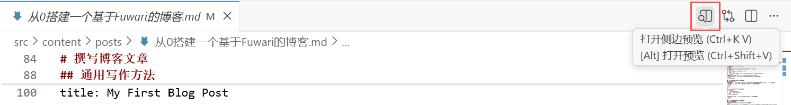
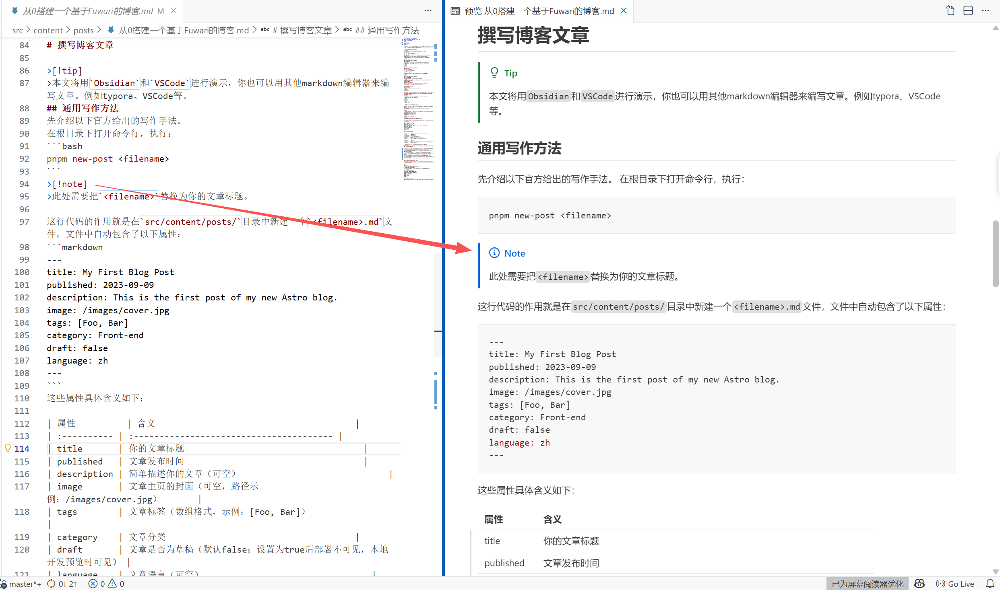
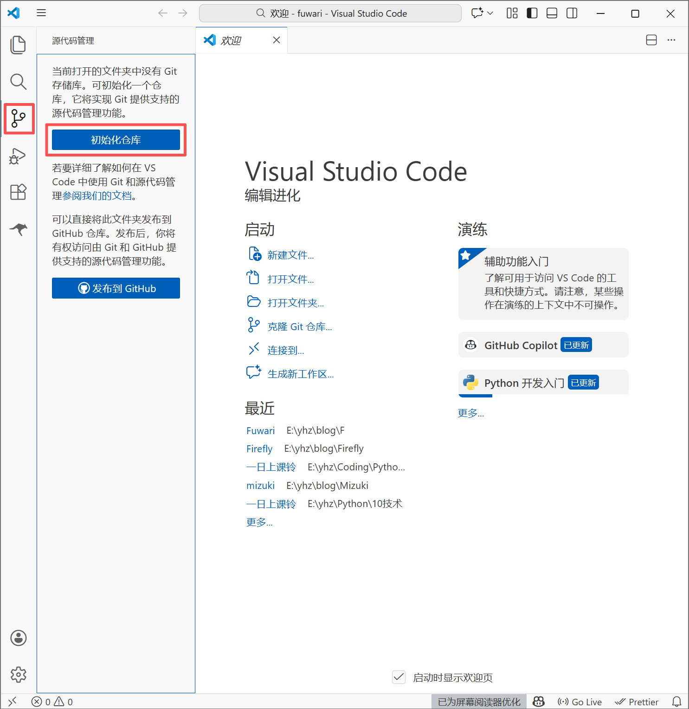
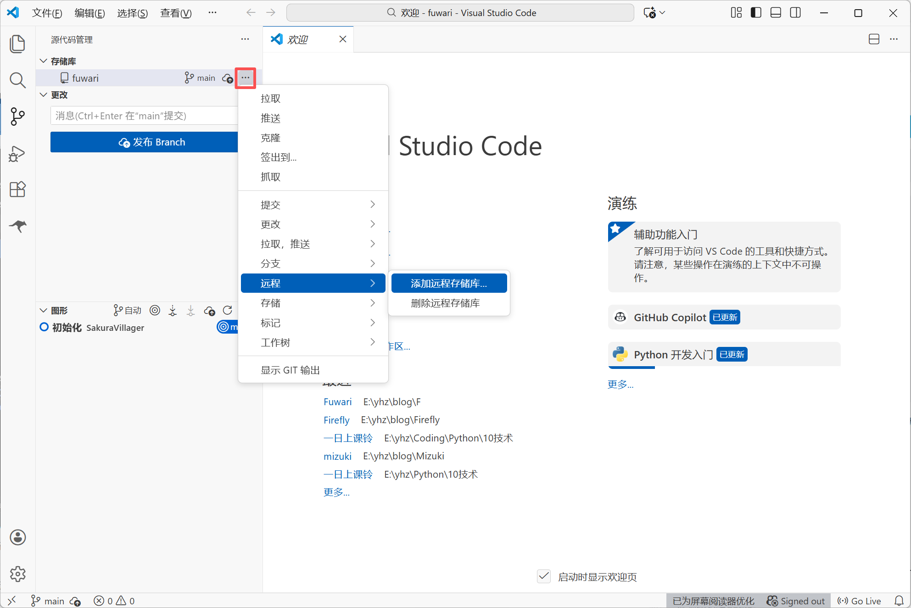
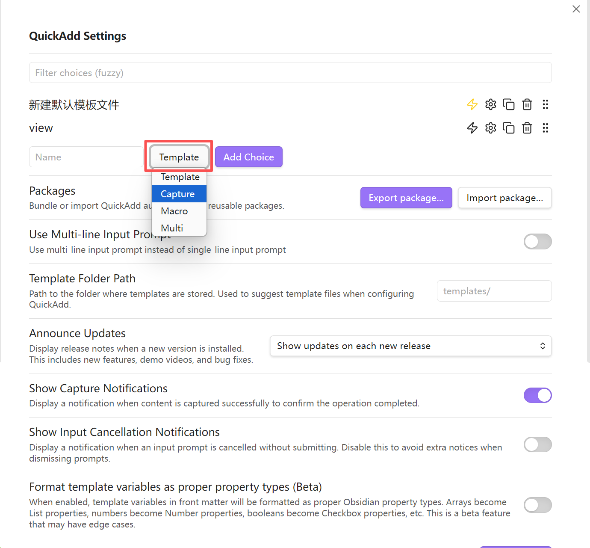
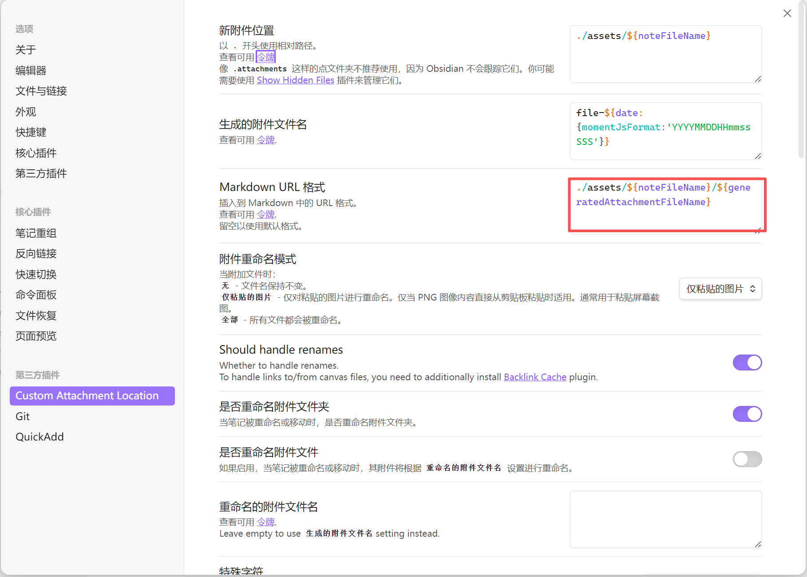

# 使用VSCode编辑文章与上传代码

>`VSCode`是一款代码开发工具，但它同时也可以干一些别的事例如撰写文章。此外，下方就是命令行，敲代码例如生成文章、开启预览也比较方便。
## 编辑文章
利用VSCode撰写文章，你需要安装扩展 `Markdown All in One`。直接在扩展中搜索安装并启用即可。
 
 生成博客还是要用到原来的代码。在下方的终端处`pnpm new-post <filename>`并回车，看到`Post src\content\posts\xxx.md created`字样，则说明创建成功了。

打开刚才创建的文件随便编辑一点，随后点击左上角的`打开侧边预览`，就可以一边编辑一边预览了。


值得好评的是，如果你的信息块采用GitHub的写法，那么tip、note等板块也可以图形化显示出来，这一点很方便。
## 提交到Git并推送
VSCode自带图形化的版本管理系统，这样就不用去记git暂存、提交、推送等操作的代码了。
### 初始化仓库
首先找到根目录下的.git文件夹并删除。
随后在VSCode中打开Fuwari文件夹到工作区，也就是左上角`文件`-`打开文件夹`
点击左侧这个像分支一样的图标，选择初始化仓库。

### 提交与推送到GitHub
每当你修改这个文件夹下的任意文件，提交按钮都会出现。你只需要给这次提交起一个标题并点击提交按钮，提交的过程就完成了。
随后回到VSCode登录你的GitHub账户。这一步需要确保你的默认浏览器登录了GitHub账户。点击`···`-`远程`-`添加远程存储库`，选择`从GitHub添加远程仓库`。这时如果你没有登录过GitHub，VSCode会提示你登录，点击允许，随后按提示登录。

登录完成以后VSCode会提示你选择存储仓库，选择你刚刚创建的那个即可。随后它会提示你起名，这个在后续不会使用到，随便取。
添加完仓库后点击`发布Branch`，你本地当前的所有文件，包括博客文章和代码，都会被上传到GitHub的对应仓库上，并且此时你的按钮会变回`提交`字样并且无法被按下。自此，你已经成功的上传代码至GitHub了。
# 利用Obsidian优雅的编写博客文章
> `Obsidian`是真的好用，不仅风格简约，还有丰富的插件来扩展功能，支持多平台，使你可以在任何设备上编写博客文章，~~虽然预览还是需要电脑~~。本文就是通过`Obsidian`编写的。

上文是采用VSCode，大部分需要代码的地方都被简化了。这固然很爽，但我们新建文章还需要敲代码来实现。那能不能直接通过模板直接创建呢？还真有，就是使用Obsidian。同时Obsidian还可以进行仓库管理（虽然第一次配置需要手动）。
首先你需要在博客项目的根目录创建obsidian仓库，随后在`.gitignore`中忽略`.obsidian`。
## 利用QuickAdd创建模板文章
在社区中搜索插件`QuickAdd`并安装、启用。
进入`QuickAdd`的设置界面，选择Capture，给命令起一个名字，随后点击`Add Choice`创建命令。

随后进入命令设置界面，在Location的Preview下方的输入框中填写
```text
src/content/posts/{{field:<文件名>}}
```
在Content的Preview下方的输入框中填写
``` markdown
---
title: {{field:<文件名>}}
published: {{DATE:YYYY-MM-DD}}
description: {{field:<文件名>}}
image: ./cover.jpg
tags: []
category: 草稿
draft: true
lang: zh
---
```


这样新建文件就自带这些模板了，解决了新建文件的问题。
## 利用Custom Attachment Location实现粘贴附件(图片)自动重命名并改为Fuwari可用格式
只需要在插件配置页中填写`Markdown URL`字段即可。
```text
./assets/${noteFileName}/${generatedAttachmentFileName}
```

## 利用Git将本地Fuwari推送到Git
> [!note] 在使用插件前，请先按照前文提到的常规方法配置git并完成首次提交。

插件基本开箱即用，不修改都没关系。我建议的修改的是打开`Pull on startup`与关闭`Push on commit-and-sync`。前者可以保证你在不同平台上写作时任然同步，后者可以减少推送次数以减少重构次数，并防止文章写一半就发布出去。
